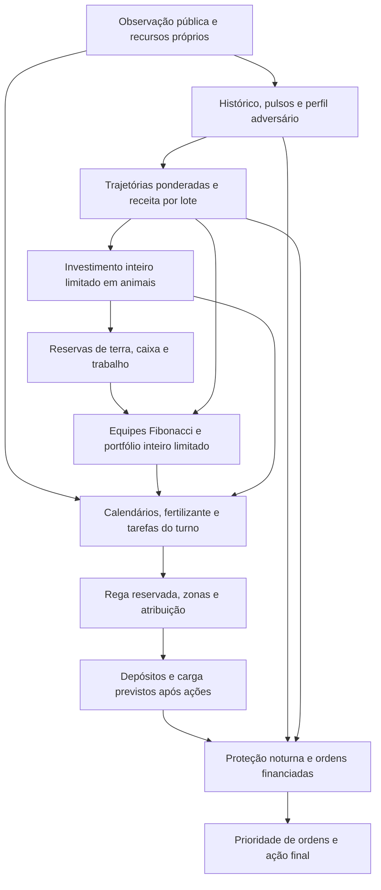

# Arquitetura 0.1.2

## Informação, estado e contratos

O runtime transforma observações em ações de cultivo, pecuária, transporte e mercado usando apenas a biblioteca padrão de Python. Utiliza preços e estoques públicos, lojas abertas, culturas e animais visíveis, recursos próprios e histórico limitado. Não lê ordens, sementes ou galpão privados do adversário, a seed do episódio, serviços externos ou replays durante uma partida.

Os contratos são os do snapshot `28b6d8af3ce73926b3d0fda1410c1ddd8384ab8c`, em `vendor/kaggriculture/`, descritos em [ENGINE_NOTES.md](ENGINE_NOTES.md). O motor não foi alterado e fica fora do pacote. Cada `FarmAgent` mantém memória de um jogador; regressão temporal ou mudança de jogador reinicia o estado.

Mercado, perfil adversário e ações são atualizados a cada decisão. O plano econômico é refeito no início do dia e a cada seis turnos. A política continua válida após início sem histórico, usando hipóteses públicas e prioridades de reparo.

## Fluxo de decisão

A pecuária precede o cultivo e reserva recursos para ele. A contratação é escolhida junto à avaliação do portfólio agrícola por enumeração de equipes. Esse encadeamento **não é uma otimização conjunta** de todos os animais, culturas, terrenos e rotas.

## Mercado e métodos numéricos

A cotação e a receita de uma venda isolada reproduzem arredondamento, curvas por produto, impacto unitário e piso do motor. Vendas ao piso não acrescentam estoque público. A compra de trigo considera a cotação após a remoção de cada unidade.

`market.py` conserva até 96 observações de fluxo por produto. As mudanças de estoque são corrigidas por consumo e ordens próprias conhecidas. O resíduo é uma estimativa, pois compras concorrentes, vendas no piso e ordens frustradas impedem identificar exatamente a venda adversária.

Na configuração padrão, seis resíduos consecutivos válidos formam sete níveis acumulados. Um ajuste quadrático local calcula a derivada na extremidade da janela, usando coeficientes de Savitzky–Golay **causais**. A tendência suavizada é limitada e combinada à média histórica. Não se usam amostras futuras, nem se atravessam lacunas ou trechos censurados pelo piso.

Culturas e animais adversários visíveis geram pulsos datados de oferta possível. Quantidade realizada, cuidado, transporte e instante de venda continuam incertos. Há dois métodos de distribuição:

| Método | Construção e limite |
| --- | --- |
| `quadrature` | Cinco trajetórias de um fator normal para fluxo externo, com nós e pesos normalizados de Gauss–Hermite. Lojas futuras entram por demanda esperada e a produção visível permanece em pulsos. |
| `scenarios` | Até 32 cenários condicionados ao estado, com futuras lojas amostradas, realização/atraso de oferta e fluxo histórico residual. |

Na quadratura, médias, quantis e probabilidades direcionais usam os **pesos não uniformes** dos cinco pontos. Não se contam as trajetórias como cinco resultados equiprováveis. O método integra uma aproximação normal; multimodalidade das lojas, comportamento adversário e interações temporais não ficam exatos. Não há promessa de equivalência a milhares de cenários nem fator fixo de aceleração.

A demanda esperada de novas lojas considera a distribuição pública de estabelecimentos e o calendário de desbloqueios. Trata-se de esperança sob as regras do motor, sem inferência de uma futura loja secreta ou de parâmetros bayesianos aprendidos.

## Lotes cronológicos, risco e preço de reserva

| API | Interpretação |
| --- | --- |
| `forecast(product, horizon_turns, sale_quantity)` | Preço e receita de um lote em um horizonte; quantis de cotação. |
| `forecast_batches(product, batches)` | Receita total de pares `(horizonte, quantidade)` e quantis de receita média por unidade. |
| `revenue_quantile(product, batches, tau)` | Quantil da receita total sobre as trajetórias empíricas/ponderadas. |
| `price_quantile(product, horizon_turns, tau)` | Quantil de preço futuro, usando modelo offline aprovado somente quando elegível. |

Todos os lotes de uma avaliação percorrem a mesma trajetória externa. A oferta adicionada pelas próprias vendas permanece nos lotes posteriores, respeitando o piso na adição de estoque. A demanda já está incluída na trajetória. Interações do piso entre oferta própria e fluxo externo permanecem aproximadas.

O retorno ajustado ao risco desconta da média `risk_aversion` vezes a diferença positiva para o quantil `risk_quantile`; os padrões são 0,35 e 0,25. Os quantis de receita multi-lote permanecem empíricos, mesmo quando existe regressão de preço futuro aprovada.

`price_quantile` pode fornecer o preço de reserva de uma venda parcial. `sale_quantity_at_reserve` encontra por **bisseção inteira** o maior lote cuja última unidade ainda alcança essa reserva. Usa a cotação oficial arredondada, com piso, e vende empates. A busca exige ordem logarítmica de consultas. Newton–Raphson não foi usado: arredondamento e piso tornam a derivada inadequada para certificar o lote discreto. A solução é exata para esse problema de lote isolado, sem garantir ótimo no mercado competitivo completo.

A retenção continua limitada por caixa, tempo e capacidade. Produtos premium podem ser vendidos antes de um risco de oferta inferido. A fila de ordens prioriza alimentação urgente e vendas expostas a queda de preço, calculada com o estoque público e oferta adversária estimada. Ordens em posições anteriores podem preceder posições posteriores do rival; a cotação simultânea no mesmo passo continua sujeita ao mecanismo simétrico do motor.

## Regressão quantílica offline e implantação seletiva

`scripts/train_quantile.py` lê replays completos de partidas reativas. Cada exemplo usa atributos públicos no instante da decisão e somente o preço futuro como alvo. Características incluem estoque, cotação, dia/hora, demanda conhecida/esperada e produção adversária visível. Ordens e estoques privados não entram no vetor.

O ajuste linear minimiza pinball com L2 por descida coordenada limitada. Médias, escalas e faixas de atributos são calculadas no treino. Os conjuntos são separados por hash de episódio e seed, incluindo lados opostos da mesma seed. O experimento inicial dispõe de oito replays locais: quatro de treino e quatro de validação. Os exemplos de um mesmo jogo e horizontes sobrepostos são correlacionados.

A aprovação ocorre por produto, com critérios registrados antes da avaliação: pelo menos dois episódios por conjunto, 30 exemplos de validação, melhora superior a 2% na perda pinball em relação à distribuição empírica e cobertura dentro da tolerância fixa. Os valores discretos de preço exigem considerar tanto `P(Y < q)` quanto `P(Y <= q)`. A validação é um filtro exploratório de implantação; não é um teste final independente da seleção.

Apenas produtos aprovados podem compor `quantile_coefficients.json`. A inferência verifica esquema, atributos, produto, horizonte e quantil treinados, integridade dos coeficientes e faixa de extrapolação. Arquivo ausente, rejeitado ou incompatível mantém o método empírico. A situação dos produtos e os resultados medidos são registrados no [índice de resultados da versão](../README.md#resultados-da-012); o modelo inicial aprovou somente `WOOL` e `FERTILIZER`, para horizonte de 24 turnos e quantil 0,25. Isso não pressupõe aprovação dos demais produtos ou ganho competitivo.

O modelo aprovado estima um **preço futuro isolado**. Substituí-lo pelo quantil da soma de várias vendas seria incorreto; por isso `forecast_batches` e `revenue_quantile` mantêm suas próprias distribuições. O treino permanece offline e o runtime recebe somente coeficientes locais e cálculos escalares.

## Otimização inteira limitada e mão de obra

`optimization.simplex` resolve relaxamentos `max c x`, com `A x <= b` e `x >= 0`, por duas fases. Normaliza coeficientes, aceita limites negativos, aplica regras de desempate de Bland e verifica viabilidade numérica.

`branch_bound` ramifica variáveis fracionárias em limites inferior/superior inteiros e usa relaxamentos para poda. Aceita um incumbente viável, mantém o limite superior global dos nós abertos e expõe `best_bound`, `gap`, número de nós e iterações. O gap é `(limite - incumbente) / max(1, abs(incumbente))`. O orçamento de nós e os desempates são determinísticos; a parada opcional por tempo é um mecanismo de interrupção entre LPs, sem garantia rígida de tempo real.

Os estados incluem `optimal`, `infeasible`, `node_limit`, `time_limit` e falhas numéricas. Um relaxamento ilimitado é reportado como `relaxation_unbounded`, sem alegar que todo o problema misto é ilimitado. **`optimal` exige fechamento da árvore**, dentro da tolerância numérica. Ao interromper, o incumbente viável continua disponível e o gap pode permanecer aberto. Não há garantia de fechar a árvore em 3–5 ms.

O portfólio agrícola usa tranches marginais de tamanho limitado, com fronteiras de sementes e margens não crescentes. As variáveis de tranche são inteiras no modo padrão. Restrições cobrem terra, liquidez de sementes, trabalho e capacidade de cada lote de colheita, descontando reservas pecuárias. O resultado é verificado no custo inteiro original; reparo e preenchimento marginal conservam uma alternativa viável. A validade de um certificado do modelo linear não se estende automaticamente ao objetivo econômico não linear ou à execução real.

A equipe é avaliada de uma unidade até o teto configurado, descartando tamanhos que excedem a capacidade útil de toda a área possível. Para cada opção, o plano desconta a contratação Fibonacci imediata e estima as contratações dos dias futuros. Trabalho das plantas e animais existentes é compromisso. Contratações imediatas reduzem o caixa disponível para sementes. O selecionado aparece em `CropPlan.workforce_target`; déficit inevitável de trabalho é registrado em vez de declarado viável.

`integer_node_limit=64` é **compartilhado entre as opções de equipe do plano agrícola**. Elas também reutilizam caches de previsão e valor. A chamada de investimento pecuário possui seu próprio orçamento. Não se deve interpretar 64 como um teto global de todas as operações do turno.

Animais, cultivo, mão de obra e mercado continuam uma aproximação sequencial. O B&B pode certificar cada problema linear inteiro fechado; não certifica o melhor jogo nem uma formulação conjunta de todas as decisões.

## Produção, pecuária e fertilização

O portfólio considera trigo, cenoura, tomate, morango e melão, preservando as plantas existentes. Culturas de colheita única formam lotes por ciclo. Tomate e morango têm os quatro pulsos sem fertilizante previstos no calendário. Novos ciclos longos precisam caber no horizonte com margem logística. Coortes sincronizadas, idades antigas e execução futura permanecem aproximações do planejamento econômico.

O investimento animal considera aquisição, produtos, fertilizante, ração e trabalho. A entrada é gradual, com até três novos animais por ciclo de planejamento e limite de animais aguardando instalação. Contam-se os animais vivos, no galpão e carregados. Os tetos padrão são oito vacas e quatro ovelhas, com núcleo eventual de até 12 células próximas ao galpão. Aquisições e expansões dependem de recursos e retorno; não são obrigatórias.

`agronomy.py` usa o calendário efetivo dos animais. O bônus antigo é pago na produção; o cuidado de hoje pode ser creditado apenas ao ciclo seguinte. `CARE` é suprimido quando esse bônus não pode ser pago antes do fim ou seria desperdiçado. Produção noturna que excederia a capacidade do animal eleva a prioridade da colheita. No último dia útil, o executor evita alimentação/cuidado sem retorno, e a contratação se restringe ao trabalho final disponível.

A decisão de fertilizante projeta a planta observada com e sem uma aplicação. Respeita a duração do efeito, os eventos finitos, os tetos por cultura e os possíveis instantes de colheita. O ganho é a diferença de unidades vendáveis valorizada pela cotação pública atual, menos venda do fertilizante e custo das ações necessárias. Não usa preço futuro conhecido nem supõe que todo melão ganha unidades extras.

A candidatura exige rota viável até o insumo e a planta, tempo de rega e, quando aplicável, colheita que libera o teto. Uma unidade de fertilizante e uma célula são reservadas por aplicação. Insumo carregado e do galpão são contabilizados separadamente; reservas consideram ações executadas no turno para evitar contagem duplicada. Plantas recém-criadas conservam a prioridade de rega. Excedentes sem aplicação rentável seguem para venda; pressão noturna pode liberar a reserva de fertilizante.

## Perfil adversário e especialistas

`OpponentModel` observa ocupação, animais, produção pronta, caixa público e mudanças visíveis de rendimento. Queda de rendimento é um sinal incerto de colheita, não prova de depósito ou venda. O resíduo público do mercado ajuda a reduzir estoque inferido, com decaimento de memória. As pontuações dos perfis passivo, pecuário, concentrado e diversificado são heurísticas normalizadas, sem calibração de identidade.

O modelo não conhece a lista de compras inicial, sementes privadas, galpão adversário nem uma fita futura. Assim, não implementa identificação determinística de um notebook nem previsão exata de suas ordens. Sua utilidade é graduar risco e prioridade de vendas próprias disponíveis.

Por padrão, especialistas agrícolas continuam selecionados por critérios determinísticos: caixa baixo favorece retorno rápido, concentração adversária penaliza culturas concorrentes e os quatro últimos dias ativam liquidação. `melon`, `cashflow`, `contrarian` e `liquidator` podem ser fixados na configuração.

`enable_contextual_bandit=True` ativa, experimentalmente, Thompson sampling linear gaussiano sobre braços `adaptive`, `melon`, `cashflow` e `contrarian`. Usa seis atributos públicos, atualiza o braço anterior pela mudança diária normalizada da margem e mantém a escolha por pelo menos três dias. A aleatoriedade é derivada do contexto observado e não usa a seed privada. A recompensa é atrasada e confundida por investimentos anteriores; não representa probabilidade calibrada de sucesso. Não há persistência de aprendizagem entre episódios. O padrão é **desativado**, e a regra de fim de jogo tem precedência.

`tactical_wheat_reserve=False` também permanece padrão. Quando habilitado, aumenta de forma limitada a reserva própria de ração diante de rebanho adversário. O trigo de mercado não é um recurso de estoque finito que possa ser bloqueado; essa opção não garante privação de alimento do rival.

## Agendamento, transporte e proteção noturna

O executor mantém preferências de zona e incentivo à continuidade de tarefa. A atribuição é gulosa por padrão, com Húngaro disponível. Navegação e prioridades permanecem discretas; não há simulação integral de 24 turnos nem campos de potencial substituindo o escalonador.

`PLANT` exige semente, presença na célula e um turno restante no mesmo dia para `WATER` pela mesma unidade. A reserva é aplicada antes da atribuição normal e confirma posição/cultura/dia. Reinício sem memória usa a prioridade de reparo da planta nova. Fertilização de planta ainda não regada também reserva a rega seguinte quando aplicável. Essa proteção agenda ações consecutivas sob o estado esperado; não altera a atomicidade do motor.

A construção segue retirada, limpeza de ervas, `BUILD_PASTURE`/`BUILD_COOP` e `PLACE`, retomando o estado observado. Sementes, insumos, retiradas e espaço de depósito são reservados na ordem das unidades. O transporte preserva animais carregados, ração necessária e fertilizante reservado.

O reflexo de entrega eleva a prioridade do trabalhador que **já carrega** produtos quando sua última janela de retorno se aproxima. O motor não oferece transferência direta de inventário entre trabalhadores; portanto não existe uma esteira de repasse de mercadorias entre unidades. Cada transportador deposita a própria carga.

`SELL` usa somente o galpão. `DROP` exige espaço para todo o inventário; `PLACE` transfere parcialmente e preserva excedente. Depósito explícito e venda podem ocorrer no mesmo turno. Nas duas últimas horas, o agente compara galpão previsto com carga que será devolvida à meia-noite, força vendas sob pressão e limita compras pela capacidade restante. A projeção considera retirada, depósito, consumo e colheita do turno, evitando contar duas vezes o trigo depositado.

Com `episodeSteps=720`, a última ação é 718 e o estado 719 é terminal. Colheita e coleta precisam deixar tempo de transporte. Compras de sementes verificam novamente o horizonte, e novas contratações no último dia dependem de trabalho final produtivo.

## Avaliação, ablações e evidência

O benchmark executa partidas reativas no motor fixado, com seeds pareadas e os dois lados. `baseline_011` e `baseline_010` carregam os arquivos originais preservados em namespaces isolados. Replays são dados de auditoria e treinamento; não substituem oponentes por ações congeladas em avaliações de força.

`adaptive`, `scenarios`, `no_fertilizer`, `simplex` e `bandit` permitem comparar componentes. As variantes legadas de duplo ciclo usam parâmetros antigos sobre o runtime atual, incluindo suas correções; somente os arquivos congelados representam código anterior intacto. Perfis sintéticos compartilham implementação e não substituem adversários competitivos independentes.

Os relatórios registram configuração, hashes, status, erros, dinheiro, margens, tempos, terra e animais. A auditoria separa ordens solicitadas de efeitos físicos. Bradley–Terry regularizado utiliza apenas jogos realizados, exclui episódios inválidos e atribui meio ponto a empates. Sua incerteza é aproximada e condicionada ao prior; componentes desconectados, seeds compartilhadas e políticas relacionadas limitam comparações. Não há equivalência garantida com rating oficial ou leaderboard.

As [notas de 0.1.2](../versoes/RELEASE_0.1.2.md) e os [resultados de 0.1.2](../README.md#resultados-da-012) distinguem implementação, testes e desempenho medido. Os relatórios [0.1.0](../relatorios/RESULTADOS.md) e [0.1.1](../relatorios/RESULTADOS_0.1.1.md) permanecem históricos. Metas e alegações dos documentos de propostas não constituem evidência de resultados ou garantias matemáticas desta implementação.
